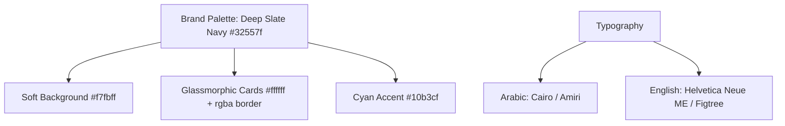
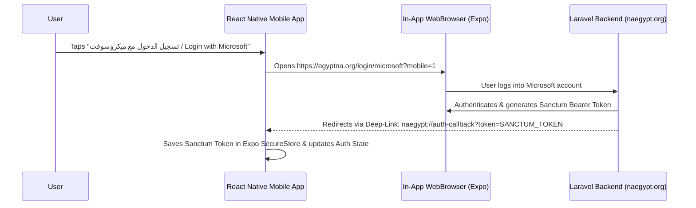

# Semi-Online React Native Mobile App Specification & Master AI Prompt
## Platform: NA-Egypt (Narcotics Anonymous Egypt)

This document provides a comprehensive UI/UX brand specification and a copy-pasteable **Master AI Prompt** for building/updating a high-performance **Semi-Online Cross-Platform Mobile Application** (iOS & Android) using **React Native (Expo + Expo Router)** and **WatermelonDB (Offline-First SQLite Database)**, matching the exact brand identity, color scheme, and live API endpoints of NA-Egypt (`naegypt.org`).

---

## 1. Brand Design System & Color Palette

The mobile application **MUST 100% replicate the visual identity, colors, and feel** of the official NA-Egypt web application.



### Color Tokens & Styling Rules:
- **Primary Brand Color:** `#32557f` (Deep Slate Navy Blue)
- **Secondary Accent:** `#10b3cf` (Cyan / Light Blue accent)
- **Background Layer:** `linear-gradient(180deg, #ffffff 0%, #f7fbff 100%)` / Base `#f7fbff`
- **Text Primary:** `#1e293b` (Dark Slate)
- **Text Muted / Subtitle:** `#64748b` (Slate Gray)
- **Card Shells:** Glassmorphic white (`#ffffff` with `rgba(50, 85, 127, 0.10)` border, `borderRadius: 20`, subtle drop shadow).
- **Badge Indicators:**
  - Open Meeting / Available: Light Emerald Pill (`#dcfce7`, text `#166534`)
  - Closed Meeting / Suspended: Light Rose Pill (`#ffe4e6`, text `#9f1239`)
  - Recurrence: Light Sky Pill (`#e0f2fe`, text `#0369a1`)

---

## 2. Authentic Microsoft OAuth Authentication Flow

The mobile app does **NOT** require manual Azure AD access tokens. It uses an **In-App WebBrowser Auth Session** matching the web experience:



---

## 3. Master AI Prompt for Mobile App Enhancement & Modification

Copy and paste this prompt into your AI coding assistant (Cursor, Claude, Bolt, ChatGPT) to overhaul and polish the React Native mobile codebase:

```text
You are a Principal React Native & Mobile UI/UX Engineer.

Task: Overhaul, redesign, and connect the Cross-Platform Mobile Application (iOS & Android) for NA-Egypt (Narcotics Anonymous Egypt) using React Native (Expo Router v3), WatermelonDB, and TypeScript to 100% match the live website UI/UX and live REST API backend at `https://egyptna.org/api/v1`.

==================================================
1. DESIGN SYSTEM & UI/UX BRAND REQUIREMENTS
==================================================
- Primary Brand Color: #32557f (Deep Slate Navy Blue).
- Secondary Accent: #10b3cf (Cyan / Highlight).
- Screen Background: Soft background #f7fbff with subtle gradient.
- Card Style: Glassmorphic cards with background #ffffff, border 1px solid rgba(50, 85, 127, 0.10), borderRadius 20, soft drop shadow (0 4px 20px rgba(50,85,127,0.08)).
- Header & Branding: Clean header with official NA symbol/logo, bilingual title "زمالة المدمنين المجهولين في مصر / NA Egypt".
- Typography: Arabic (Cairo / Amiri), English (Helvetica Neue ME / Figtree).
- Layout Direction & RTL: Dynamic LTR / RTL switching based on selected language (Arabic default RTL).

==================================================
2. AUTHENTICATION (MICROSOFT SSO DEEP-LINKING)
==================================================
- DO NOT ask the user for manual Azure AD tokens or credentials.
- Provide a single sleek "Login with Microsoft / تسجيل الدخول بحساب ميكروسوفت" button.
- When tapped, use `expo-web-browser` / `expo-auth-session`:
  ```ts
  const result = await WebBrowser.openAuthSessionAsync(
    'https://egyptna.org/login/microsoft?mobile=1',
    'naegypt://auth-callback'
  );
  ```
- Listen for deep-link `naegypt://auth-callback?token=...`, extract `token`, and store securely using `expo-secure-store`.
- Maintain authenticated state across app restarts with automatic Bearer token injection in Axios requests.

==================================================
3. LIVE REAL DATA SYNC (NO MOCK DATA ALLOWED)
==================================================
- STRICT REQUIREMENT: Eliminate ALL hardcoded dummy/mock meeting data arrays from the mobile app codebase.
- API Base URL: `https://egyptna.org/api/v1` (MUST use https:// and default header `Accept: application/json`).
- Fetch live data from `/api/v1/meetings`, `/api/v1/cities`, `/api/v1/neighborhoods`, `/api/v1/topics`, `/api/v1/options`, `/api/v1/events` and sync into WatermelonDB.
- Meetings API Payload Attributes to render:
  - `group_name_ar` / `group_name_en`
  - `city_name_ar` / `city_name_en`
  - `neighborhood_name_ar` / `neighborhood_name_en`
  - `formatted_start_time` / `formatted_end_time` / `duration`
  - `type` (Open/Closed), `lang` (Arabic/English), `status` (available/suspended)
  - `address_ar` / `address_en` / `location_url` / `meeting_url`
  - `topics` (Array of topic tags) & `options` (Array of feature tags like Wheelchair accessible)
- Render skeleton shimmer loaders while initial sync is in progress and support pull-to-refresh.

==================================================
4. FEATURE SCREENS TO OVERHAUL
==================================================
1. Home / Meeting Finder Screen:
   - Search bar (by Group name or location) with glassmorphism styling.
   - Filter pills (City, Neighborhood, Day, Language, In-Person / Online).
   - List of Meeting Cards matching exact web design (#32557f headings, badged pills, map directions button).
   - Favorite / Bookmark meeting button saved in local WatermelonDB.

2. Events & Calendar Screen:
   - Upcoming events list with live data from `/api/v1/events` and `/api/v1/calendar-events`.
   - Push notification toggle for events.

3. Literature & Information Screen:
   - Just For Today (JFT) daily reading view.
   - Informational sections for Literature, Speakers, and Questions.

4. Authenticated Service & Agendas Screen:
   - Available only when logged in via Microsoft SSO.
   - Group Agendas & Service Body Agendas list and status badges.
   - Committee Reports view with embedded PDF downloader/viewer.

5. Change Request / Contact Form:
   - Form for submitting meeting updates or public inquiries.
   - File attachment support. Saves to WatermelonDB outbox when offline and syncs automatically when online.

==================================================
5. GENERATION INSTRUCTIONS
==================================================
Provide full, clean, modular TypeScript code files for Expo Router:
- `app/_layout.tsx` (Deep-link listener, RTL setup, WatermelonDB provider)
- `app/(tabs)/index.tsx` (Meeting Finder with live API sync and web-matching UI)
- `app/(tabs)/events.tsx`
- `app/(tabs)/service.tsx`
- `src/api/client.ts` (Axios client with HTTPS & Accept: application/json)
- `src/auth/useAuth.ts` (WebBrowser Microsoft SSO hook)
- `src/theme/colors.ts` (#32557f palette definitions)

Ensure zero errors, zero mock data, and 100% adherence to NA-Egypt UI/UX styling.
```
