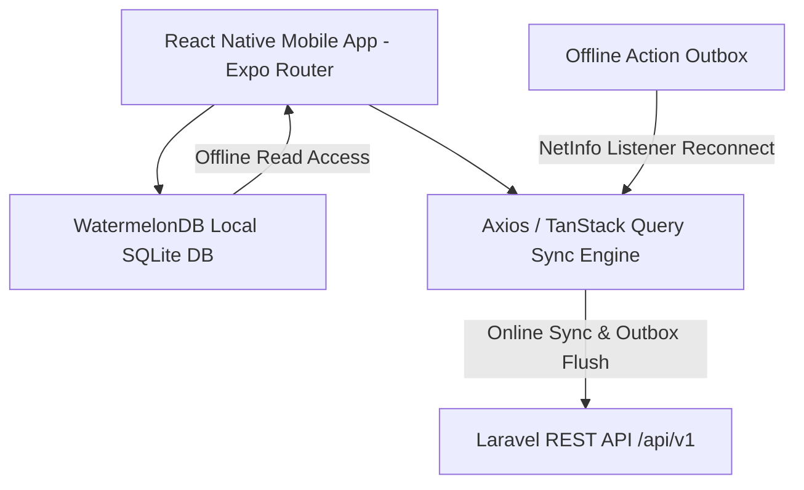

# Semi-Online React Native Mobile App Specification & AI Master Prompt
## Platform: NA-Egypt (Narcotics Anonymous Egypt)

This document provides an architecture specification and a copy-pasteable **Master AI Prompt** for building a high-performance **Semi-Online Cross-Platform Mobile Application** (iOS & Android) using **React Native (Expo + Expo Router)** and **WatermelonDB (Offline-First SQLite Database)**, powered by the NA-Egypt Laravel RESTful API backend.

---

## 1. Technical Architecture Recommendations

Based on the NA-Egypt API capabilities and mobile application requirements, the following stack is recommended for a semi-online experience:



| Domain Layer | Technology / Recommendation | Rationale |
| :--- | :--- | :--- |
| **Framework** | Expo (Expo Router v3 + Dev Builds) | File-based routing, native config plugins for WatermelonDB SQLite, native iOS/Android builds. |
| **Local Storage Engine** | WatermelonDB (`@nozbe/watermelondb`) | High-performance, lazy-loaded, SQLite-backed reactive database built specifically for offline-first React Native apps. |
| **Offline Write Strategy** | Outbox Queue Pattern | Offline state-changing operations (Change Requests, Contact Forms) are queued in WatermelonDB `outbox_actions` table and automatically synced when `@react-native-community/netinfo` detects connectivity. |
| **Authentication** | Azure AD OAuth + Expo SecureStore | Azure AD SSO token exchange (`/api/v1/auth/azure/login`) to receive Laravel Sanctum Bearer token stored securely in `expo-secure-store`. |
| **Localization & RTL** | `i18next` + `react-i18next` + `I18nManager` | Bilingual support (Arabic `ar` & English `en`) with dynamic Right-to-Left (RTL) layout switching. |

---

## 2. API Architecture & Endpoint Mapping

- **Base URL:** `/api/v1`
- **Auth Header:** `Authorization: Bearer <sanctum_token>`

### 2.1 Public Endpoints (Cached in WatermelonDB)
- `GET /api/v1/meetings` (Includes `group`, `day`, `topics`, `options`)
- `GET /api/v1/cities` & `GET /api/v1/neighborhoods`
- `GET /api/v1/days`, `GET /api/v1/topics`, `GET /api/v1/options`
- `GET /api/v1/groups` & `GET /api/v1/events`
- `GET /api/v1/calendar-events`
- `GET /api/v1/agendas`

### 2.2 Protected Endpoints (Requires Sanctum Auth Token & Network Connection / Outbox Queue)
- `POST /api/v1/auth/azure/login` (Azure AD token exchange)
- `GET /api/v1/user`
- `GET / POST / PUT / DELETE /api/v1/service-body-agendas`
- `GET / POST / PUT / DELETE /api/v1/committee-reports`
- `POST /api/v1/contact-requests` (Supports offline outbox queuing)
- `POST /api/v1/meetings` (Change request / meeting update)

---

## 3. Master AI Prompt for React Native Generation

Copy and paste the prompt below into your AI coding assistant (Cursor, Claude, Bolt, ChatGPT) to generate the React Native codebase:

```text
You are an expert React Native & Mobile Systems Engineer.

Task: Build a production-ready, semi-online Cross-Platform Mobile Application (iOS & Android) for NA-Egypt (Narcotics Anonymous Egypt) using React Native with Expo (Expo Router) and WatermelonDB for offline persistence, connected to the Laravel RESTful API backend described below.

==================================================
1. TECH STACK & REQUIREMENTS
==================================================
- Framework: React Native with Expo (Expo Router v3, TypeScript).
- Offline Storage Engine: WatermelonDB (@nozbe/watermelondb) with SQLite native adapter.
- Network Layer: Axios with TanStack Query and NetInfo (@react-native-community/netinfo) connection monitoring.
- State & Sync Management: WatermelonDB reactive observers + custom Outbox Synchronization Engine.
- Secure Storage: expo-secure-store for Sanctum Bearer tokens.
- Localization: i18next + react-i18next with full RTL (Right-to-Left) layout support for Arabic and LTR for English.

==================================================
2. SEMI-ONLINE & OFFLINE-FIRST DESIGN
==================================================
A. Read Path (Offline First):
   - On app launch or background sync, fetch public API datasets (/api/v1/meetings, /api/v1/cities, /api/v1/neighborhoods, /api/v1/events, /api/v1/topics, /api/v1/options) and persist/upsert into WatermelonDB.
   - All Meeting Finder queries, filtering, and searches read directly from local WatermelonDB tables for instant UI response and 100% offline availability.

B. Write Path (Outbox Queue Pattern):
   - When user submits a Change Request or Contact Form while offline or with weak connectivity, create an entry in the WatermelonDB `outbox_actions` table with status 'pending', timestamp, endpoint, and payload (including base64/file path for attachments).
   - A background sync worker monitors NetInfo. When network is active, it flushes the outbox actions sequentially to the API and updates status to 'synced'.

==================================================
3. WATERMELONDB SCHEMA SPECIFICATION
==================================================
Define the following WatermelonDB models and appSchema (version 1):
- `meetings`: id, remote_id, group_id, day_id, start_time, end_time, notes, type, lang, status, recurrence (json), updated_at
- `groups`: id, remote_id, name, group_type, city_id, neighborhood_id, updated_at
- `cities`: id, remote_id, ar_name, en_name, updated_at
- `neighborhoods`: id, remote_id, city_id, ar_name, en_name, updated_at
- `days`: id, remote_id, ar_name, en_name, code
- `topics`: id, remote_id, ar_name, en_name
- `options`: id, remote_id, ar_name, en_name
- `events`: id, remote_id, title, description, start_date, end_date, location, updated_at
- `outbox_actions`: id, endpoint, method, payload (json), status, retry_count, created_at

==================================================
4. APP FEATURE & UI MODULES
==================================================
1. Meeting Finder (Bilingual AR/EN + RTL):
   - Instant search bar (Group Name, Location).
   - Multi-filter modal: City, Neighborhood, Day, Language (Arabic/English), Options (Accessibility, Open/Closed).
   - Card layout with map directions button, time formatting, and topic tags.
   - Bookmark / Favorite meeting toggle saved locally.

2. Events & Workshops:
   - List and calendar view of fellowship events read from local DB.
   - Push notifications via expo-notifications for scheduled events.

3. Authenticated Service & Agendas Area:
   - Azure AD OAuth login flow (`POST /api/v1/auth/azure/login` with access_token).
   - Secure storage of Sanctum token.
   - View/Manage Group Agendas and Service Body Agendas with role permissions.
   - Integrated PDF Viewer for viewing committee reports.

4. Change Request & Contact Forms:
   - Submit form for meeting schedule modifications or public inquiries.
   - File attachment selector (image/PDF picker via expo-document-picker / expo-image-picker).
   - Outbox status feedback: "Saved offline. Will submit when back online."

==================================================
5. CODEBASE STRUCTURE TO GENERATE
==================================================
Provide a clean architecture project structure:
/src
  /api          -> Axios client, interceptors, Sanctum auth helpers
  /database     -> WatermelonDB schema, models, sync engine, outbox sync worker
  /i18n         -> ar.json, en.json, RTL configuration
  /features
    /auth       -> Azure AD login, token management
    /meetings   -> Meeting Finder UI, filters, hooks
    /events     -> Calendar & event detail UI
    /agendas    -> Group & Service Body agenda views, PDF viewer
    /outbox     -> Offline submission status UI
  /components   -> Reusable UI (Buttons, Cards, Modals, Skeleton Loaders)
app/            -> Expo Router file-based screens (_layout.tsx, index.tsx, etc.)

Provide complete TypeScript code files, WatermelonDB database initialization, setup commands for Expo plugins, and build instructions for iOS and Android.
```

---

## 4. Developer Setup & Expo Configuration Notes

1. **WatermelonDB Expo Plugin Setup:**
   WatermelonDB uses native SQLite code. Ensure `app.json` includes `expo-build-properties` for iOS/Android native compilation:
   ```json
   {
     "expo": {
       "plugins": [
         [
           "expo-build-properties",
           {
             "android": { "kotlinVersion": "1.8.0" },
             "ios": { "useFrameworks": "static" }
           }
         ]
       ]
     }
   }
   ```

2. **RTL Support Configuration:**
   Enable RTL support in `app.json` and initialize `I18nManager`:
   ```json
   {
     "expo": {
       "extra": {
         "supportsRTL": true
       }
     }
   }
   ```
