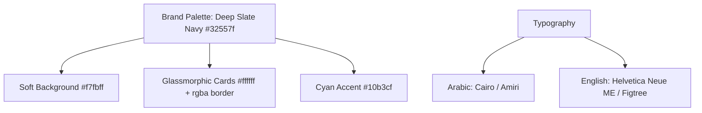
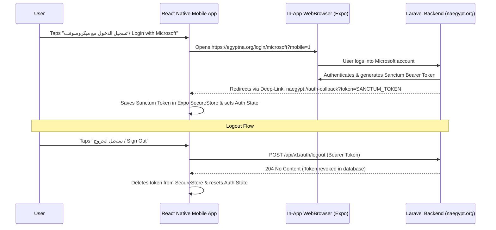

# Semi-Online React Native Mobile App Specification & Master AI Prompt
## Platform: NA-Egypt (Narcotics Anonymous Egypt)

This document provides a comprehensive UI/UX brand specification, offline-first WatermelonDB schema, and a copy-pasteable **Master AI Prompt** for building/updating a high-performance **Semi-Online Cross-Platform Mobile Application** (iOS & Android) using **React Native (Expo + Expo Router)** and **WatermelonDB (Offline-First SQLite Database)**, matching the exact brand identity, color scheme, and live REST API v1 endpoints of NA-Egypt (`naegypt.org` / `egyptna.org`).

---

## 1. Brand Design System & Color Palette

The mobile application **MUST 100% replicate the visual identity, colors, and feel** of the official NA-Egypt web application.



### Color Tokens & Styling Rules:
- **Primary Brand Color:** `#32557f` (Deep Slate Navy Blue)
- **Secondary Accent:** `#10b3cf` (Cyan / Light Blue accent)
- **Background Layer:** `linear-gradient(180deg, #ffffff 0%, #f7fbff 100%)` / Base `#f7fbff`
- **Text Primary:** `#1e293b` (Dark Slate)
- **Text Muted / Subtitle:** `#64748b` (Slate Gray)
- **Card Shells:** Glassmorphic white (`#ffffff` with `rgba(50, 85, 127, 0.10)` border, `borderRadius: 20`, subtle drop shadow: `0 4px 20px rgba(50, 85, 127, 0.08)`).
- **Badge Indicators:**
  - Open Meeting / Available: Light Emerald Pill (`#dcfce7`, text `#166534`)
  - Closed Meeting / Suspended: Light Rose Pill (`#ffe4e6`, text `#9f1239`)
  - Recurrence: Light Sky Pill (`#e0f2fe`, text `#0369a1`)
  - Virtual / Online Meeting: Light Cyan Pill (`#cffafe`, text `#0e7490`)

---

## 2. Authentic Microsoft OAuth & Session Lifecycle

The mobile app supports seamless sign-in via Microsoft SSO (Office 365) and secure token revocation on logout:



---

## 3. WatermelonDB Local Offline-First Schema Architecture

To support intermittent connectivity and fast startup times across Egypt, the app caches core data models in SQLite via WatermelonDB:

```typescript
import { appSchema, tableSchema } from '@nozbe/watermelondb';

export const appDatabaseSchema = appSchema({
  version: 2,
  tables: [
    tableSchema({
      name: 'meetings',
      columns: [
        { name: 'server_id', type: 'number', isIndexed: true },
        { name: 'day_id', type: 'number' },
        { name: 'group_id', type: 'number', isOptional: true },
        { name: 'direct_online_group_id', type: 'number', isOptional: true },
        { name: 'group_name_ar', type: 'string' },
        { name: 'group_name_en', type: 'string' },
        { name: 'group_type', type: 'string' },
        { name: 'city_name_ar', type: 'string', isOptional: true },
        { name: 'city_name_en', type: 'string', isOptional: true },
        { name: 'neighborhood_name_ar', type: 'string', isOptional: true },
        { name: 'neighborhood_name_en', type: 'string', isOptional: true },
        { name: 'start_time', type: 'string' },
        { name: 'end_time', type: 'string' },
        { name: 'formatted_start_time', type: 'string' },
        { name: 'formatted_end_time', type: 'string' },
        { name: 'duration', type: 'number' },
        { name: 'type', type: 'string' },
        { name: 'lang', type: 'string' },
        { name: 'status', type: 'string' },
        { name: 'address_ar', type: 'string', isOptional: true },
        { name: 'address_en', type: 'string', isOptional: true },
        { name: 'location_url', type: 'string', isOptional: true },
        { name: 'meeting_url', type: 'string', isOptional: true },
        { name: 'is_favorite', type: 'boolean' },
      ],
    }),
    tableSchema({
      name: 'direct_online_groups',
      columns: [
        { name: 'server_id', type: 'number', isIndexed: true },
        { name: 'ar_name', type: 'string' },
        { name: 'en_name', type: 'string' },
        { name: 'phone', type: 'string', isOptional: true },
        { name: 'location', type: 'string' }, // Zoom / Teams link
      ],
    }),
    tableSchema({
      name: 'calendar_events',
      columns: [
        { name: 'server_id', type: 'number', isIndexed: true },
        { name: 'title', type: 'string' },
        { name: 'start', type: 'string' },
        { name: 'end', type: 'string' },
        { name: 'description', type: 'string', isOptional: true },
        { name: 'location', type: 'string', isOptional: true },
        { name: 'color', type: 'string' },
        { name: 'is_featured', type: 'boolean' },
      ],
    }),
    tableSchema({
      name: 'change_requests_outbox',
      columns: [
        { name: 'request_type', type: 'string' },
        { name: 'subject', type: 'string' },
        { name: 'description', type: 'string' },
        { name: 'local_attachment_uri', type: 'string', isOptional: true },
        { name: 'sync_status', type: 'string' }, // pending, syncing, synced
      ],
    }),
  ],
});
```

---

## 4. Live REST API v1 Catalog for Mobile Clients

| Endpoint | Method | Auth | Description |
| :--- | :--- | :--- | :--- |
| `/api/v1/home` | `GET` | Public | Consolidated home screen payload: stats, JFT daily reading, helpline contacts, social links, upcoming events. |
| `/api/v1/jft` | `GET` | Public | Structured Just For Today reflection with clean Arabic content. |
| `/api/v1/meetings` | `GET` | Public | Complete meetings finder with filtering (`city`, `day`, `virtualOnly`, `englishOnly`, `search`). |
| `/api/v1/direct-online-groups`| `GET` | Public | Online fellowship recovery groups with virtual meeting links. |
| `/api/v1/calendar-events` | `GET` | Public | Calendar events with date range recurrence expansion (`?start=YYYY-MM-DD&end=YYYY-MM-DD`). |
| `/api/v1/events` | `GET` | Public | Announcements and fellowship activities. |
| `/api/v1/forms/public/{slug}` | `GET` | Public | Public custom form schema and dynamic fields for rendering surveys. |
| `/api/v1/forms/public/{slug}/submit` | `POST` | Public | Submit responses to a published form (`201 Created`). |
| `/api/v1/auth/azure/login` | `POST` | Public | Direct Azure token exchange for Sanctum token. |
| `/api/v1/auth/logout` | `POST` | `Bearer` | Revokes current Sanctum personal access token (`204 No Content`). |
| `/api/v1/user` | `GET` | `Bearer` | Authenticated user profile and assigned service body. |
| `/api/v1/change-requests` | `POST` | `Bearer` | Multipart submission for meeting/group change requests with file attachments up to 5MB (`201 Created`). |
| `/api/v1/workgroups` | `GET` | Public | Service committee workgroups directory. |

---

## 5. Master AI Prompt for Mobile App Enhancement & Modification

Copy and paste this prompt into your AI coding assistant (Cursor, Claude, Bolt, ChatGPT) to overhaul and polish the React Native mobile codebase:

```text
You are a Principal React Native & Mobile UI/UX Engineer.

Task: Overhaul, redesign, and connect the Cross-Platform Mobile Application (iOS & Android) for NA-Egypt (Narcotics Anonymous Egypt) using React Native (Expo Router v3), WatermelonDB, and TypeScript to 100% match the live website UI/UX and live REST API backend at `https://egyptna.org/api/v1`.

==================================================
1. DESIGN SYSTEM & UI/UX BRAND REQUIREMENTS
==================================================
- Primary Brand Color: #32557f (Deep Slate Navy Blue).
- Secondary Accent: #10b3cf (Cyan / Highlight).
- Screen Background: Soft background #f7fbff with subtle linear gradient.
- Card Style: Glassmorphic cards with background #ffffff, border 1px solid rgba(50, 85, 127, 0.10), borderRadius 20, soft drop shadow (0 4px 20px rgba(50,85,127,0.08)).
- Header & Branding: Clean header with official NA symbol/logo, bilingual title "زمالة المدمنين المجهولين في مصر / NA Egypt".
- Typography: Arabic (Cairo / Amiri), English (Helvetica Neue ME / Figtree).
- Layout Direction & RTL: Dynamic LTR / RTL switching based on selected language (Arabic default RTL).

==================================================
2. AUTHENTICATION & SESSION LIFECYCLE
==================================================
- Login: DO NOT ask user for manual credentials. Provide "Login with Microsoft / تسجيل الدخول بحساب ميكروسوفت".
  Use `expo-web-browser`:
  ```ts
  const result = await WebBrowser.openAuthSessionAsync(
    'https://egyptna.org/login/microsoft?mobile=1',
    'naegypt://auth-callback'
  );
  ```
- Deep-Link: Listen for `naegypt://auth-callback?token=...`, extract token, and save to `expo-secure-store`.
- Logout: When the user signs out, call `POST /api/v1/auth/logout` with Bearer token, then clear `expo-secure-store` and reset WatermelonDB auth state.

==================================================
3. LIVE DATA SYNC & OFFLINE WATERMELONDB
==================================================
- STRICT REQUIREMENT: Zero mock data.
- API Base URL: `https://egyptna.org/api/v1` with headers `Accept: application/json`.
- Fetch live data and sync into local WatermelonDB:
  - `/api/v1/home` (Stats, JFT, Helplines)
  - `/api/v1/meetings` & `/api/v1/direct-online-groups`
  - `/api/v1/calendar-events`
- Prioritized Meeting URL Resolution:
  Render meeting link by checking: `meeting.location_url` -> `meeting.meeting_url` -> `group.location` -> `direct_online_group.zoom_url`.
- Render skeleton shimmer loaders during initial fetch, and provide smooth pull-to-refresh on all tab screens.

==================================================
4. FEATURE SCREENS TO OVERHAUL
==================================================
1. Home & Meeting Finder Screen:
   - Search bar (by group name or location) with glassmorphic styling.
   - Filter pills (City, Neighborhood, Day, Language, Virtual Only).
   - In-Person and Direct Online Groups tabs.
   - Card items with formatted time, badged pills, map directions button, and one-tap Zoom launch.
   - Bookmark / favorite toggle stored in local SQLite database.

2. Daily Spiritual Reflection (Just For Today - JFT):
   - Rich Arabic reading view with clean typography, page date header, inspirational quote box, and thought for the day card.

3. Events & Calendar Screen:
   - List and monthly calendar view with live data from `/api/v1/calendar-events`.
   - Date range expansion filter (`start` & `end` query params).

4. Custom Forms & Surveys Screen:
   - Dynamic form renderer fetching form schema from `/api/v1/forms/public/{slug}`.
   - Supports text, email, number, date, yes/no, and dynamic select fields.
   - Submits payload to `/api/v1/forms/public/{slug}/submit`.

5. Change Requests & Service Screen:
   - Form for members to submit meeting changes or committee inquiries with file attachment upload.
   - Saves to local outbox when offline and syncs via multipart POST `/api/v1/change-requests` when connection restores.

6. Profile & Settings Screen:
   - User profile info, language switcher (Arabic RTL / English LTR), helpline shortcuts, and Sign Out button.

==================================================
5. GENERATION INSTRUCTIONS
==================================================
Provide full, clean, modular TypeScript files for Expo Router:
- `app/_layout.tsx` (Deep-link listener, RTL setup, WatermelonDB provider)
- `app/(tabs)/index.tsx` (Meeting Finder with live API sync)
- `app/(tabs)/jft.tsx` (Daily reflection)
- `app/(tabs)/events.tsx`
- `app/(tabs)/service.tsx`
- `src/api/client.ts` (Axios client with automatic Sanctum token header injection)
- `src/auth/useAuth.ts` (WebBrowser Microsoft SSO & Sign-out hook)
- `src/database/schema.ts` (WatermelonDB schema)
- `src/theme/colors.ts` (#32557f palette definitions)

Ensure zero errors, zero mock data, and 100% fidelity to NA-Egypt brand aesthetics.
```
